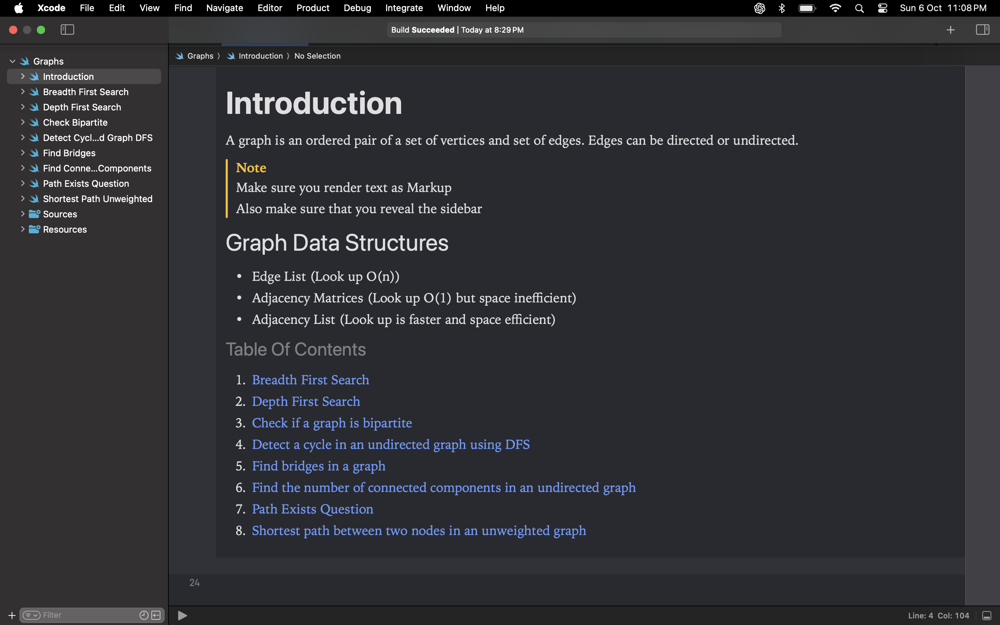

<kbd>
  </kbd>

# DSA Using Swift!
This repository contains a collection of data structures and algorithms implemented in Swift. The goal is to provide clear, concise, and optimized solutions to common problems while demonstrating best practices in Swift programming.

## Intructions

